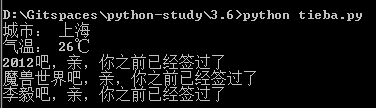

# python-study
-----------------------------
> some usefull script of python

###    openoffice.py
* 采用OpenOffice附件转换时，由于一些无法估测的因素转换失败，导致OpenOffice进程卡死，每隔五分钟检查一次openoffice端口，如果无法ping通，则启动openoffice
* openoffice.sh 启动命令 ./openoffice.sh start 停止命令 ./openoffice.sh stop
* openoffice.py 可使用命令开启：nohup /home/ekoz/openoffice.py &

### rmfile.py
* 定时清理 Jetty 服务器产生的日志

### diskwarning.py
* 在某些项目中，日志文件过大会导致磁盘饱满无法写入。当前脚本定时检测指定路径下的大小，如果超出预警值控制台输出报警信息，并且删除单个超出临界值的文件

		pathlist 设置需要统计的目录大小，数据类型是元组
		maxSize 设置总限额，单位 M ，该值作为一个预警值，只起到提醒作用
		maxFileSize 设置单个文件删除临界值，单位 M ，如果检测到所有文件大小超过预警值(maxSize)，则删除pathlist下超过临界值(maxFileSize)的文件
		interval 设置定时器执行频率，单位 分钟

### scp_timer.py
* 从远端服务器获取指定目录下的所有文件夹和文件，复制到本地指定的文件夹

### jenkins
	采用jenkins打包后生成的是war，jenkins本身是支持打包为zip并传送到发布服务器上的，但是用起来比较繁琐，而且不够灵活，当前脚本可以获取jenkins上的服务并发布到相应的服务器
	
* cp_jenkins.sh 
```
从jenkins获取相应的war包到当前目录，用法如下
./cp_jenkins.sh your_war_name package_version_no
```

* war_zip.sh
```
将 war 转成拥有顶级目录的zip包，用法如下
./war_zip.sh your_war_name
```
	
* scp_rc.py
```
将 zip 包发布到指定的服务器，支持同时传输多个文件，用法如下
./scp_rc.py your_zip_file0 your_zip_file1 your_zip_file2
```

### get_package.py
	从发布地址拿安装包到本地目录

### archives.py
	针对 git archive 增量包发布编译后的包
	
### fileencoding.py
  批量修改文件编码，效果如图所示
  
  

### mcgov.py
	爬取政府官网处理民众信访事项，将数据导入至solr容器进行查询
	
### tieba.py
贴吧签到神器，大部分代码是从 [loavne/all-login](https://github.com/loavne/all-login) Copy，效果如下：

